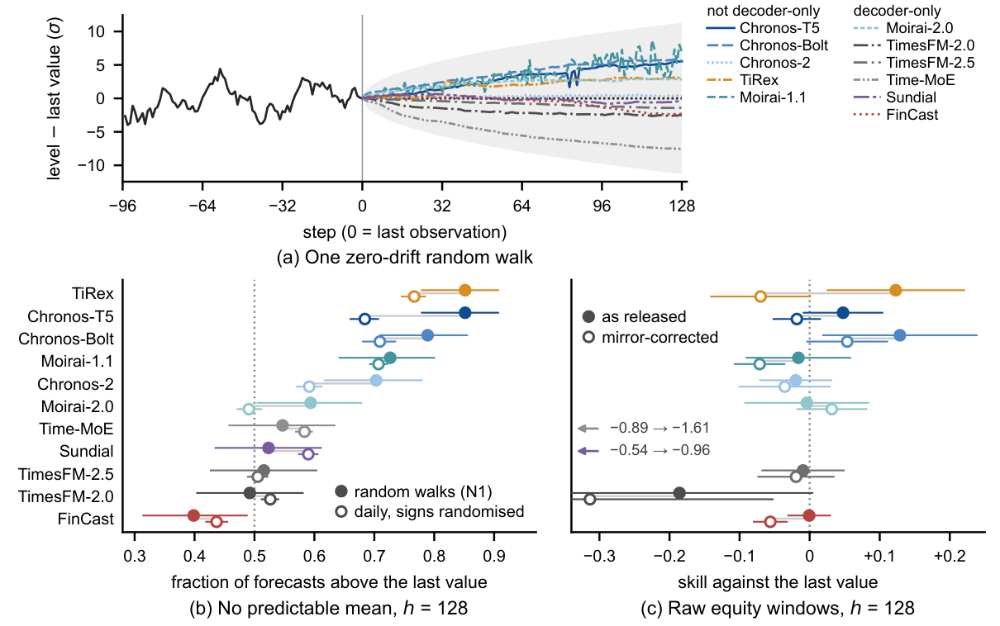
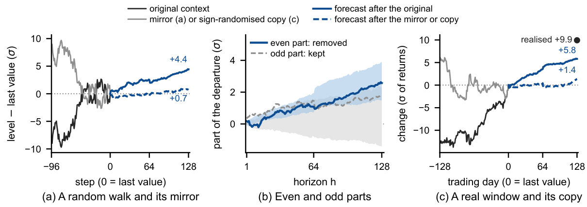
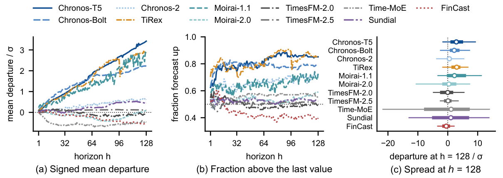
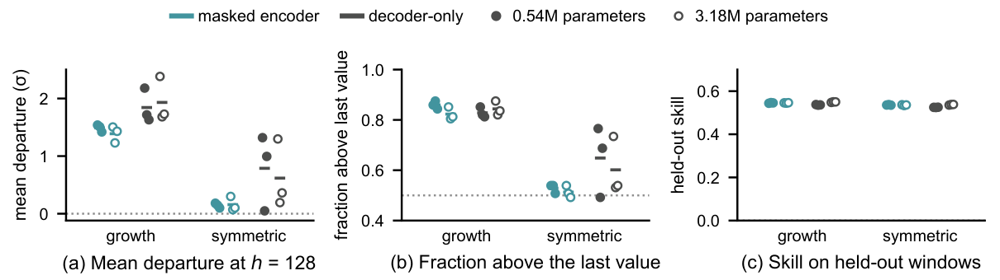
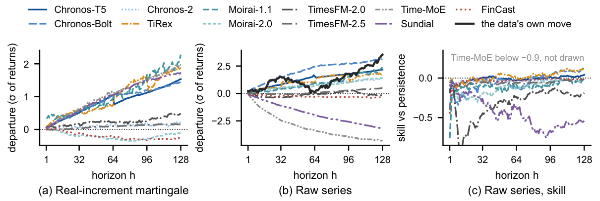
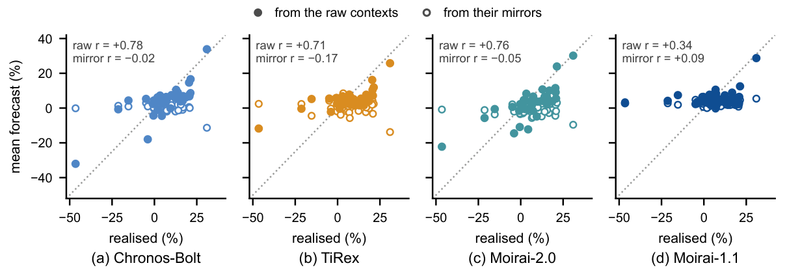
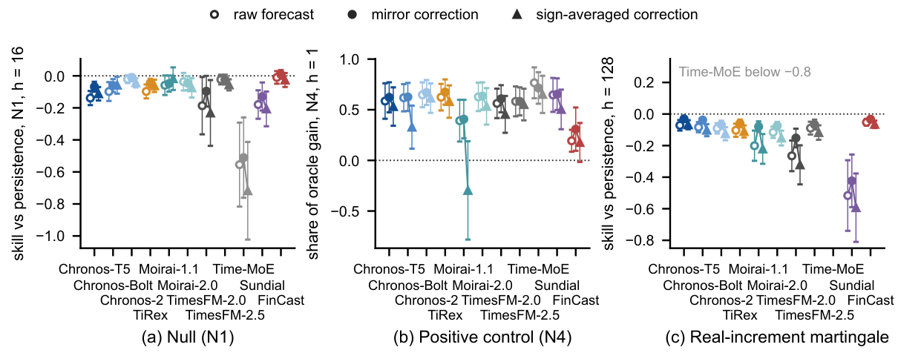

<div align="center">

# When There Is Nothing to Predict
### Directional Bias in Time Series Foundation Models

**Anonymous authors** · ICLR 2027 submission (under double-blind review)


[Overview](#overview) · [Findings](#key-findings) · [Method](#the-probe) · [Models](#models) · [Quick start](#quick-start) · [Layout](#repository-layout) · [Reproduction guide](docs/REPRODUCE.md)

</div>

<p align="center">
  
</p>
<p align="center"><em>
<b>Directional bias looks like skill on a rising market.</b> (a) Eleven released models forecast 128 steps of one zero-drift random walk, whose optimal forecast is the last value; the band is one standard deviation of the future increment. (b) Share of forecasts above the last value on random walks (filled) and on daily prices with randomised return signs (open). (c) Skill against the last value on rising equity windows, as released (filled) and after the mirror correction (open).
</em></p>

## Overview

Time series foundation models forecast a new series from its context alone. We ask what they
forecast **when there is nothing to predict**. On a martingale the last observed value is the best
point forecast under squared loss, and the excess risk of any other forecast equals the mean square
of its departure from that value, so what a model adds can be measured against a known optimum.

Several released models carry a **directional bias** that, on rising markets, looks like skill.
This repository contains the probe, the eleven model drivers, every result file the paper is built
from, and the scripts that turn those files into each table, figure and number in the text.

## Key findings

| | Finding | Evidence |
|---|---|---|
| **1** | **Every model departs from the last value, and several lean upward.** On Gaussian, GARCH and heavy-tailed random walks all eleven models lose to the last value; the five that are not decoder-only forecast a rise on up to 85% of contexts. | random-walk ladder |
| **2** | **Architecture alone does not decide the sign.** A masked encoder and a decoder-only model trained from scratch both acquire the upward bias from a corpus with positive trends. | controlled corpus experiment |
| **3** | **On real prices, bias and skill are confounded.** Every model loses once the return signs are randomised; on rising equities, removing the part of each forecast that ignores the sign of the history lowers 128-day skill for ten of the eleven models. | 1,280 daily windows, 70 series |
| **4** | **Some models have seen the history.** On 1996–2014 windows several models time the market far better than trend rules read from the same contexts, and the public M4 daily data used in pretraining hold the US market's path for 82% of those trading days. | timing, calendar-shift and corpus checks |
| **5** | **Removing the bias is safe only under symmetry.** The mirror correction lowers risk whenever past and future are symmetric under negation; an exact identity accounts for its losses elsewhere. Mirror augmentation during fine-tuning removes most of Chronos-Bolt's bias. | synthetic ladder, raw prices, fine-tuning |

## The probe

Under a martingale null, $\mathbb{E}[y_{t+h}\mid \mathcal{F}_t]=y_t$, so for any forecast $\hat y_{t+h}$

$$
\mathbb{E}\big[(y_{t+h}-\hat y_{t+h})^2\big]-\mathbb{E}\big[(y_{t+h}-y_t)^2\big]
=\mathbb{E}\big[(\hat y_{t+h}-y_t)^2\big],
$$

the excess risk is exactly the mean squared **departure** $D=\hat y_{t+h}-y_t$ from the last value.
Splitting $D$ over a history $x$ and its mirror image $\bar x$ gives an **odd** part, which changes
sign with the history, and an **even** part, which does not. The **mirror correction** keeps the odd
part, $D \mapsto \tfrac12\big(D(x)-D(\bar x)\big)$, at the cost of one extra forward pass.

<p align="center">
  
</p>
<p align="center"><em>
<b>A forecast that rises after a history and after its mirror carries a directional bias.</b> (a) Chronos-T5 forecasts a rise after a random walk and still a rise after its mirror. (b) The even part, removed by the correction, and the odd part, kept. (c) A real US market window and its sign-randomised copy.
</em></p>

## Results at a glance

<table>
<tr>
<td width="50%"><br>
<sub><b>On random walks the five models that are not decoder-only drift upward</b>, more so at longer horizons.</sub></td>
<td width="50%"><br>
<sub><b>A corpus with positive trends is enough</b> to make either model design forecast a rise.</sub></td>
</tr>
<tr>
<td width="50%"><br>
<sub><b>On daily prices the upward departures survive randomised signs</b> and run with the market's own rise.</sub></td>
<td width="50%"><br>
<sub><b>Three models time the 1996–2014 market from the actual histories only</b>, not from their mirrors.</sub></td>
</tr>
</table>

<p align="center">
  
</p>
<p align="center"><em>
<b>The mirror correction lowers risk under symmetry and can cost skill on raw prices.</b>
</em></p>

## Models

All models are used as released, without fine-tuning (except the fine-tuning experiment).

| Family | Model | Checkpoint | Design |
|---|---|---|---|
| Chronos | Chronos-T5 | `amazon/chronos-t5-{tiny,mini,small,base,large}` | encoder–decoder, tokenised values |
| | Chronos-Bolt | `amazon/chronos-bolt-small` | encoder–decoder, patches |
| | Chronos-2 | `amazon/chronos-2` | encoder, patches |
| Moirai | Moirai-1.1 | `Salesforce/moirai-1.1-R-small` | masked encoder |
| | Moirai-2.0 | `Salesforce/moirai-2.0-R-small` | decoder-only |
| TimesFM | TimesFM-2.0 | `google/timesfm-2.0-500m-pytorch` | decoder-only |
| | TimesFM-2.5 | `google/timesfm-2.5-200m-pytorch` | decoder-only, flip-invariant |
| Time-MoE | Time-MoE | `Maple728/TimeMoE-200M` | decoder-only, mixture of experts |
| TiRex | TiRex | `NX-AI/TiRex` | recurrent (xLSTM) |
| Sundial | Sundial | `thuml/sundial-base-128m` | decoder-only, flow matching |
| FinCast | FinCast | `Vincent05R/FinCast` | decoder-only, finance corpus |

## Quick start

Rebuild every table and figure from the shipped results (CPU, a few minutes):

```bash
bash scripts/run_analysis.sh
```

This runs the generator tests and the numerical checks of the analytical claims, downloads the two
public data sources (ECB reference rates and the Kenneth R. French library, not redistributed),
rebuilds the daily windows and checks them against a fingerprint, then regenerates `paper/tables/`
and `paper/figures/` from `results/`.

Rerun a model on the daily windows (GPU, one environment per model family):

```bash
bash scripts/install_chronos.sh          # or install_moirai.sh, install_timesfm.sh, ...
source scripts/env_chronos.sh
cd code
$PY real_probe.py --model chronosbolt            # raw windows and their sign-randomised copies
$PY real_probe.py --model chronosbolt --mirror   # mirrored windows, for the correction
```

The later experiments (falling markets, calendar-shift and corpus checks, directional accuracy,
fine-tuning, larger corpus models) live in [`paper/experiments/`](paper/experiments/README.md),
together with the prediction files written before each run.

## Repository layout

```
code/               probe, null-process generators, model drivers, summaries, table and figure generators
scripts/            install / environment / run scripts, one per model family
data/               download scripts, sources and checksums (provider data are not redistributed)
results/            every result file the paper is built from
paper/tables/       generated LaTeX tables (+ facts.json, the numbers quoted in the text)
paper/figures/      generated figures (PDF/SVG)
paper/experiments/  later experiments: scripts, results, and the time-stamped prediction files
assets/             images for this page
docs/REPRODUCE.md   full reproduction guide: which script writes which table and figure
MANIFEST.sha256     checksum of every file
```

## Data

The daily anchor uses the European Central Bank's euro reference rates and the Kenneth R. French data
library; the intraday anchor uses one day of Nasdaq TotalView-ITCH sample data; the positive controls
use ETTh1 and the Ken French size deciles. None is redistributed here: `data/*/download_*.sh` fetch
them from the providers, and `data/*/SOURCES.md` record URLs, coverage and terms.

## Citation

```bibtex
@inproceedings{anonymous2027nothing,
  title     = {When There Is Nothing to Predict: Directional Bias in Time Series Foundation Models},
  author    = {Anonymous},
  booktitle = {Submitted to the International Conference on Learning Representations (ICLR)},
  year      = {2027}
}
```
